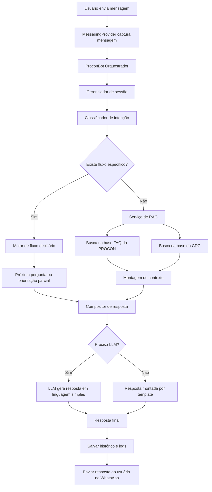
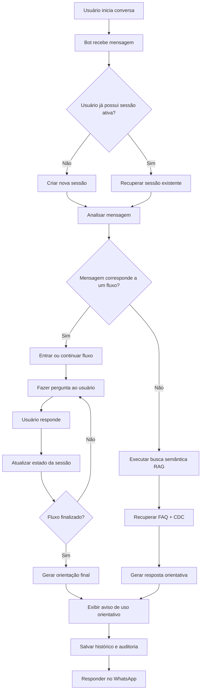
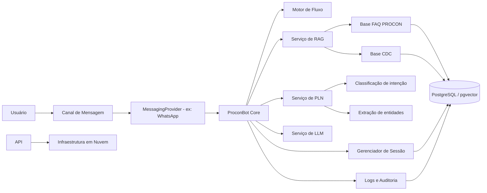
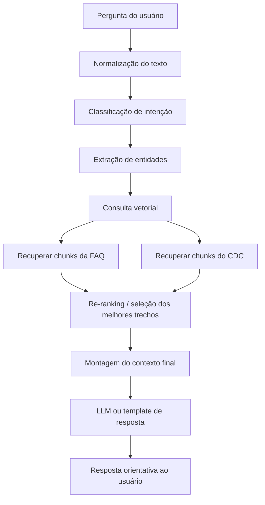
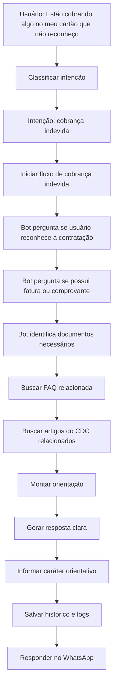

<h1 align="center"> ProconBot Jacareí </h1>

<h2 align="center"> FATEC Professor Francisco de Moura, Jacareí - 6º Semestre DSM 2026 </h2>

  <a href="#sobre">Sobre</a> |
  <a href="#visao">Visão do Produto</a> |
  <a href="#backlog">Product Backlog</a> |
  <a href="#sprints">Sprints</a> |
  <a href="#fluxos">Fluxos</a> |
  <a href="#equipe">Equipe</a>

---

<h1 align="center">Sobre</h1>

Este projeto foi desenvolvido pelos alunos do 6º semestre de Desenvolvimento de Software Multiplataforma (DSM) da Fatec de Jacareí como parte da Aprendizagem Baseada em Projeto (ABP). O **ProconBot Jacareí** é um chatbot inteligente que auxilia consumidores a obter orientações iniciais sobre seus direitos utilizando o WhatsApp como canal principal de comunicação.

A solução combina fluxos decisórios baseados nas orientações do PROCON com técnicas de **Processamento de Linguagem Natural (PLN)** e **RAG (Retrieval Augmented Generation)**. A base de conhecimento utilizada pelo sistema inclui as **FAQs do PROCON** e o **Código de Defesa do Consumidor (CDC)**, permitindo recuperar informações relevantes para orientar os usuários.

O sistema utiliza **Node.js e TypeScript no backend**, integração com **WhatsApp via whatsapp-web.js**, armazenamento de dados em banco relacional e infraestrutura em **computação em nuvem**, permitindo registrar interações, auditar respostas e gerar orientações claras aos consumidores.

---

<h1 align="center">Visão do Produto</h1>

<h3>Descrição</h3>

Um chatbot inteligente acessível via **WhatsApp** que fornece orientação inicial sobre direitos do consumidor, utilizando:

- 🔀 Fluxos decisórios baseados nas orientações do PROCON  
- 📚 Recuperação de conhecimento (**RAG**) baseada nas FAQs e no Código de Defesa do Consumidor  
- 🧠 Técnicas de **PLN** para interpretação de mensagens  
- ✍️ Geração controlada de respostas com **LLM**  
- ☁️ Infraestrutura em nuvem para execução e persistência  

<h3>Objetivo</h3>

Auxiliar cidadãos a entender seus direitos e os próximos passos para resolver problemas de consumo.

---

<h1 align="center">Product Backlog</h1>

| ID   | Req. | User Story                                       | Prioridade | Story Points |
|------|------|--------------------------------------------------|:----------:|:------------:|
| US01 | RF01 | Integrar chatbot ao WhatsApp                     | P0 | 5 |
| US02 | RF01 | Receber mensagens de usuários                    | P0 | 3 |
| US03 | RF01, RF04 | Enviar respostas ao usuário                | P0 | 3 |
| US04 | RF03 | Gerenciar sessões de conversa                    | P0 | 3 |
| US05 | RF02, RF03 | Criar motor de fluxo decisório            | P0 | 5 |
| US06 | RF02, RF03, RF04 | Implementar fluxo de cobrança indevida | P0 | 3 |
| US07 | RF02, RF03, RF04 | Implementar fluxo de empréstimo não reconhecido | P0 | 3 |
| US08 | RF02, RF03, RF04 | Implementar fluxo de direito de arrependimento | P0 | 3 |
| US09 | RF02, RF03, RF04 | Implementar fluxo de cancelamento de plano | P1 | 3 |
| US10 | RF02, RF03, RF04 | Implementar fluxo de garantia de produto | P1 | 3 |
| US11 | RF06 | Persistir histórico de mensagens                 | P0 | 3 |
| US12 | RF02, RF03 | Estruturar base FAQ do PROCON              | P0 | 3 |
| US13 | RF05 | Implementar ingestão do CDC PDF                  | P1 | 5 |
| US14 | RF05 | Realizar chunking do CDC                         | P1 | 3 |
| US15 | RF05 | Gerar embeddings da base de conhecimento         | P1 | 5 |
| US16 | RF05 | Implementar busca semântica (RAG)                | P1 | 5 |
| US17 | RF02, RF03 | Classificar intenção da mensagem           | P1 | 5 |
| US18 | RF03 | Extrair entidades relevantes                     | P2 | 3 |
| US19 | RF05, RNF05 | Integrar LLM para resposta final          | P1 | 3 |
| US20 | RF06 | Implementar logs de auditoria                    | P1 | 3 |
| US21 | RNF02 | Criar deploy em nuvem                           | P0 | 5 |
| US22 | RNF02 | Criar container Docker                          | P1 | 3 |
| US23 | RNF02 | Criar pipeline CI/CD                            | P2 | 3 |
| US24 | RF04, RNF04 | Implementar fallback para atendimento presencial | P1 | 2 |
| US25 | RNF04, RNF05 | Adicionar aviso de uso de IA             | P1 | 1 |
| US26 | RF06 | Criar dashboard simples de métricas              | P2 | 5 |
| US27 | RNF02 | Implementar monitoramento e logs                | P2 | 3 |
| US28 | RNF02 | Criar testes básicos                            | P2 | 3 |
| US29 | RNF01, RNF03 | Documentar arquitetura                   | P2 | 2 |
| US30 | RNF01 | Criar documentação de uso                       | P2 | 2 |
| US31 | RNF02, RNF03 | Configurar banco de dados                | P0 | 5 |
| US32 | RF03, RF06 | Persistir sessões no banco                 | P0 | 3 |
| US33 | RF01, RF03 | Criar fluxo de agendamento                 | P1 | 5 |
| US34 | RF03, RF06 | Listar horários disponíveis                | P1 | 5 |
| US35 | RF06, RNF03 | Persistir agendamentos                    | P1 | 3 |
| US36 | RF04 | Confirmar agendamento ao usuário                 | P1 | 2 |
| US37 | RF03, RF06 | Cancelar ou reagendar atendimento         | P2 | 3 |

---

<h1 align="center">Sprints</h1>

<h3>Sprint 1 — MVP do Chatbot</h3>

**Objetivo:**  
Implementar a comunicação via WhatsApp e os primeiros fluxos de atendimento do PROCON.

**Backlog da Sprint:**

| ID | Req. | User Story | Pontos |
|----|------|------------|-------|
| US01 | RF01 | Integrar chatbot ao WhatsApp | 5 |
| US02 | RF01 | Receber mensagens de usuários | 3 |
| US03 | RF01, RF04 | Enviar respostas ao usuário | 3 |
| US04 | RF03 | Gerenciar sessões de conversa | 3 |
| US05 | RF02, RF03 | Criar motor de fluxo decisório | 5 |
| US06 | RF02, RF03, RF04 | Fluxo cobrança indevida | 3 |
| US07 | RF02, RF03, RF04 | Fluxo empréstimo não reconhecido | 3 |
| US08 | RF02, RF03, RF04 | Fluxo direito de arrependimento | 3 |
| US09 | RF02, RF03, RF04 | Fluxo cancelamento de plano | 3 |

<h3>Sprint 2 — Inteligência + Persistência</h3>

**Objetivo:**  
Implementar base de conhecimento, interpretação de linguagem e persistência de dados.

**Backlog da Sprint:**

| ID | Req. | User Story | Pontos |
|----|------|------------|-------|
| US10 | RF02, RF03, RF04 | Fluxo garantia de produto | 3 |
| US11 | RF06 | Persistir histórico de mensagens | 3 |
| US12 | RF02, RF03 | Estruturar base FAQ | 3 |
| US13 | RF05 | Ingestão CDC PDF | 5 |
| US14 | RF05 | Chunking CDC | 3 |
| US15 | RF05 | Gerar embeddings | 5 |
| US16 | RF05 | Implementar busca semântica (RAG) | 5 |
| US17 | RF02, RF03 | Classificar intenção | 5 |
| US18 | RF03 | Extrair entidades | 3 |
| US31 | RNF02, RNF03 | Configurar banco de dados | 5 |
| US32 | RF03, RF06 | Persistir sessões no banco | 3 |

<h3>Sprint 3 — Infraestrutura Cloud e Governança</h3>

**Objetivo:**  
Realizar deploy em nuvem, implementar observabilidade, governança, documentação e fluxo de agendamento.

**Backlog da Sprint:**

| ID | Req. | User Story | Pontos |
|----|------|------------|-------|
| US19 | RF05, RNF05 | Integrar LLM para resposta final | 3 |
| US20 | RF06 | Logs auditoria | 3 |
| US21 | RNF02 | Deploy em nuvem | 5 |
| US22 | RNF02 | Container Docker | 3 |
| US23 | RNF02 | Pipeline CI/CD | 3 |
| US24 | RF04, RNF04 | Fallback atendimento presencial | 2 |
| US25 | RNF04, RNF05 | Aviso uso IA | 1 |
| US26 | RF06 | Dashboard métricas | 5 |
| US27 | RNF02 | Monitoramento | 3 |
| US28 | RNF02 | Testes | 3 |
| US29 | RNF01, RNF03 | Documentação arquitetura | 2 |
| US30 | RNF01 | Documentação uso | 2 |
| US33 | RF01, RF03 | Criar fluxo de agendamento | 5 |
| US34 | RF03, RF06 | Listar horários disponíveis | 5 |
| US35 | RF06, RNF03 | Persistir agendamentos | 3 |
| US36 | RF04 | Confirmar agendamento ao usuário | 2 |
| US37 | RF03, RF06 | Cancelar ou reagendar atendimento | 3 |

<h1 align="center">Equipe</h1> 

 
| Função          | Nome                     | GitHub                                                       | LinkedIn |
|-----------------|--------------------------|--------------------------------------------------------------|----------|
| Product Owner   | Mauro do Prado Santos    |  |  |
| Scrum Master    | Vitor Cezar de Souza     |  |  |
| Dev Team        | Igor Fonseca             |  |  |
| Dev Team    | Jonatas Filipe Carvalho  |  |  |
| Dev Team        | Samuel Lucas Vieira de Melo |  |  |

---

<h1 align="center">Fluxos Esperados</h1>

<h3>1. Fluxo geral do sistema</h3>

 

<h3>2. Fluxo da conversa no WhatsApp</h3>

<h3>3. Arquitetura da Solução</h3>

<h3>4. Fluxo interno do RAG</h3>

<h3>5. Fluxo de um caso prático</h3>

