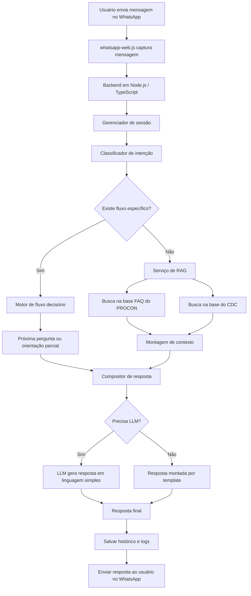
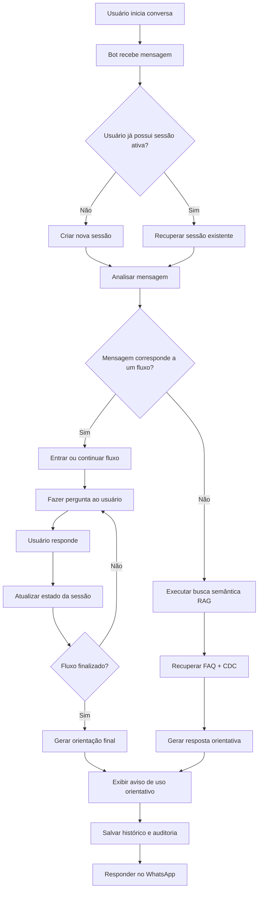
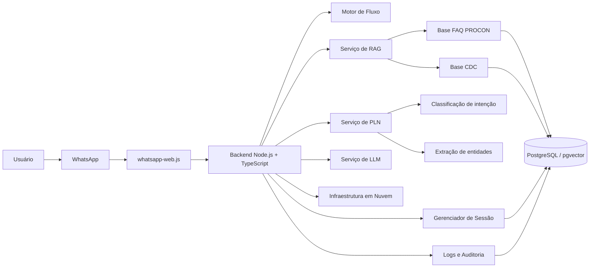
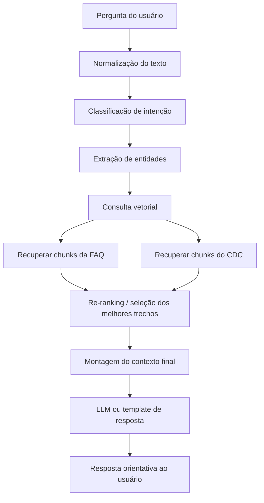
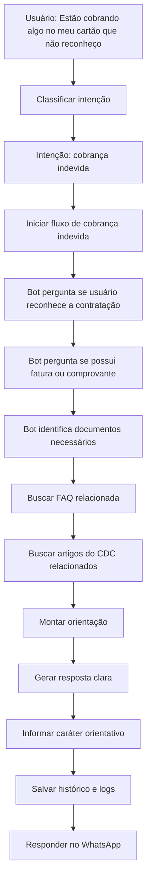

# 🤖 ProconBot Jacareí

> Chatbot inteligente para orientação sobre direitos do consumidor via WhatsApp.

---

## 📋 Visão do Produto

### Descrição

Um chatbot inteligente acessível via **WhatsApp** que fornece orientação inicial sobre direitos do consumidor, utilizando:

- 🔀 Fluxos decisórios baseados nas orientações do PROCON
- 📚 Recuperação de conhecimento (**RAG**) baseada nas FAQs e no Código de Defesa do Consumidor
- 🧠 Técnicas de **PLN** para interpretação de mensagens
- ✍️ Geração controlada de respostas com **LLM**
- ☁️ Infraestrutura em nuvem para execução e persistência

### 🎯 Objetivo

Auxiliar cidadãos a entender seus direitos e os próximos passos para resolver problemas de consumo.

### 👥 Usuários

- Consumidores da cidade
- Estudantes / testadores do sistema

---

## 🧑‍💼 Personas

### Consumidor

Pessoa que teve problema com empresa e precisa saber:

- Se tem direito
- Que documentos levar
- Como reclamar

### Administrador / Auditor

Precisa:

- Consultar histórico
- Analisar conversas
- Validar orientações do chatbot

---

## ✅ Definition of Done (DoD)

Uma história será considerada concluída quando:

#### 💻 Código
- [ ] Implementado em **TypeScript**
- [ ] Versionado no **GitHub**
- [ ] Revisado por pelo menos **1 membro** da equipe

#### 🧪 Testes
- [ ] Fluxo principal testado manualmente
- [ ] Erros tratados adequadamente

#### ☁️ Infraestrutura
- [ ] Funcional em ambiente cloud
- [ ] Container **Docker** construído
- [ ] Variáveis de ambiente configuradas

#### 🔗 Integração
- [ ] Integração com **WhatsApp** funcionando
- [ ] Banco persistindo dados

#### 🤖 IA
- [ ] Uso de LLM restrito à geração textual
- [ ] Resposta baseada em dados recuperados (**RAG**)

#### 📄 Documentação
- [ ] README atualizado
- [ ] Descrição da feature registrada

---

## 📊 Escala de Pontuação

### Story Points (Fibonacci)

| Pontos | Complexidade   |
|--------|----------------|
| 1      | Trivial        |
| 2      | Simples        |
| 3      | Moderado       |
| 5      | Complexo       |
| 8      | Muito complexo |

---

## 🎯 Critério de Priorização

Priorização baseada em:

1. 💡 Valor para o usuário
2. 🔧 Dependência técnica
3. ⚠️ Risco técnico
4. 📐 Requisito da disciplina

### Categorias de prioridade

| Nível | Descrição |
|-------|-----------|
| **P0** | 🔴 Crítico |
| **P1** | 🟠 Alto    |
| **P2** | 🟡 Médio   |
| **P3** | 🟢 Baixo   |

---

## 📝 Product Backlog Completo

| ID   | User Story                                       | Prioridade | Story Points |
|------|--------------------------------------------------|:----------:|:------------:|
| US01 | Integrar chatbot ao WhatsApp                     | P0         | 5            |
| US02 | Receber mensagens de usuários                    | P0         | 3            |
| US03 | Enviar respostas ao usuário                      | P0         | 3            |
| US04 | Gerenciar sessões de conversa                    | P0         | 3            |
| US05 | Criar motor de fluxo decisório                   | P0         | 5            |
| US06 | Implementar fluxo de cobrança indevida           | P0         | 3            |
| US07 | Implementar fluxo de empréstimo não reconhecido  | P0         | 3            |
| US08 | Implementar fluxo de direito de arrependimento   | P0         | 3            |
| US09 | Implementar fluxo de cancelamento de plano       | P1         | 3            |
| US10 | Implementar fluxo de garantia de produto         | P1         | 3            |
| US11 | Persistir histórico de mensagens                 | P0         | 3            |
| US12 | Estruturar base FAQ do PROCON                    | P0         | 3            |
| US13 | Implementar ingestão do CDC PDF                  | P1         | 5            |
| US14 | Realizar chunking do CDC                         | P1         | 3            |
| US15 | Gerar embeddings da base de conhecimento         | P1         | 5            |
| US16 | Implementar busca semântica (RAG)                | P1         | 5            |
| US17 | Classificar intenção da mensagem                 | P1         | 5            |
| US18 | Extrair entidades relevantes                     | P2         | 3            |
| US19 | Integrar LLM para resposta final                 | P1         | 3            |
| US20 | Implementar logs de auditoria                    | P1         | 3            |
| US21 | Criar deploy em nuvem                            | P0         | 5            |
| US22 | Criar container Docker                           | P1         | 3            |
| US23 | Criar pipeline CI/CD                             | P2         | 3            |
| US24 | Implementar fallback para atendimento presencial | P1         | 2            |
| US25 | Adicionar aviso de uso de IA                     | P1         | 1            |
| US26 | Criar dashboard simples de métricas              | P2         | 5            |
| US27 | Implementar monitoramento e logs                 | P2         | 3            |
| US28 | Criar testes básicos                             | P2         | 3            |
| US29 | Documentar arquitetura                           | P2         | 2            |
| US30 | Criar documentação de uso                        | P2         | 2            |

---

## Fluxos Esperados
### Fluxo geral do sistema

---
### Fluxo da conversa no WhatsApp

---
### Arquitetura da Solução

---
### Fluxo interno do RAG

---
### Fluxo de um caso prático

