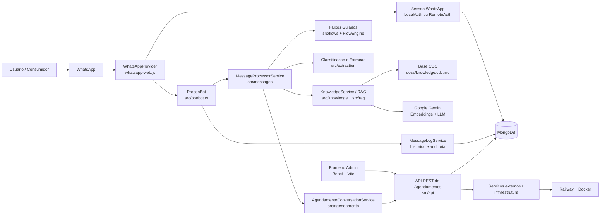
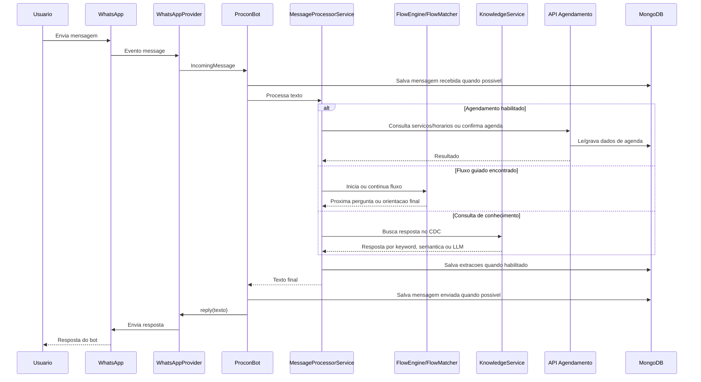

# Documentacao de Arquitetura - ProconBot Jacarei

Atualizado em: 2026-06-08

## 1. Visao Geral

O ProconBot Jacarei e uma solucao de atendimento inicial ao consumidor via WhatsApp. O sistema combina fluxos guiados de orientacao, busca em base de conhecimento do Codigo de Defesa do Consumidor (CDC), uso opcional de LLM com Gemini, persistencia em MongoDB e uma API de apoio para dashboard, KPIs e agendamentos.

O frontend administrativo em `frontend/` centraliza as telas de gestao e acompanhamento do atendimento, exibindo dados de conversas, agendamentos, metricas, usuarios, relatorios e base de conhecimento a partir da integracao com o backend.

## 2. Visao de Alto Nivel



## 3. Principais Componentes

### 3.1 Chatbot WhatsApp

Responsavel por conectar o sistema ao canal de atendimento do usuario.

Arquivos principais:

- `src/whatsapp/whatsapp-provider.ts`
- `src/bot/bot.ts`
- `src/server.ts`

Responsabilidades:

- inicializar o cliente `whatsapp-web.js`;
- autenticar via QR Code ou codigo de pareamento;
- ignorar mensagens de grupos, status e mensagens enviadas pelo proprio bot;
- evitar processamento duplicado de mensagens recentes;
- encaminhar mensagens recebidas ao processador central;
- responder o usuario no mesmo canal.

A sessao do WhatsApp pode ser salva localmente em `.wwebjs_auth/` usando `LocalAuth` ou no MongoDB usando `RemoteAuth`, quando o banco estiver conectado.

### 3.2 Orquestrador do Bot

O `ProconBot` coordena o fluxo basico de cada mensagem:

1. registra a mensagem recebida;
2. resolve ou cria uma sessao de conversa, quando o MongoDB esta disponivel;
3. envia o texto para `MessageProcessorService`;
4. registra a resposta gerada;
5. responde ao usuario no WhatsApp.

Esse desenho separa o canal de mensagem da regra de negocio. Assim, o bot nao depende diretamente do WhatsApp dentro do processamento central.

### 3.3 Processamento de Mensagens

Arquivo principal: `src/messages/message-processor.service.ts`.

O processador decide o que fazer com cada mensagem recebida. A ordem de prioridade e:

1. continuar ou iniciar conversa de agendamento, quando habilitada;
2. continuar uma sessao de fluxo guiado ja existente;
3. tratar comandos de menu, ajuda ou retorno;
4. identificar um fluxo especifico por numero, palavras-chave ou NLP;
5. consultar a base de conhecimento via RAG/CDC;
6. devolver fallback quando a mensagem nao e entendida.

Tambem sao extraidas entidades estruturais e classificacoes de intencao para posterior auditoria e melhoria do atendimento.

### 3.4 Motor de Fluxos Guiados

Arquivos principais:

- `src/engine/flow-engine.ts`
- `src/flows/flow-registry.ts`
- `src/flows/*.json`
- `docs/flows/*.md`

Fluxos implementados:

- cobranca indevida;
- emprestimo nao reconhecido;
- direito de arrependimento;
- cancelamento de plano ou servico;
- garantia de produto.

Cada fluxo e definido em JSON, com perguntas, opcoes, recomendacoes, documentos sugeridos e mensagem final. O `FlowEngine` controla a etapa atual da conversa e atualiza a sessao do usuario.

### 3.5 NLP e Extracao de Dados

Arquivos principais:

- `src/extraction/nlp-flow-classifier.ts`
- `src/extraction/flow-extraction-orchestrator.ts`
- `src/extraction/structural-regex.ts`
- `src/extraction/deterministic-flow-match.ts`

Responsabilidades:

- classificar a intencao da mensagem;
- combinar mensagens com fluxos conhecidos;
- extrair dados estruturais, como CPF, protocolo ou informacoes relevantes;
- persistir logs de extracao quando houver MongoDB e sessao de conversa.

### 3.6 Base de Conhecimento, RAG e LLM

Arquivos principais:

- `src/knowledge/knowledge-service.ts`
- `src/knowledge/markdown-cdc.repository.ts`
- `src/knowledge/semantic-cdc.repository.ts`
- `src/rag/build-index.ts`
- `src/rag/gemini-embedding.service.ts`
- `src/rag/gemini-llm.service.ts`
- `docs/knowledge/cdc.md`
- `src/knowledge/cdc-index.json`

Funcionamento:

- sem `GEMINI_API_KEY`, o sistema usa busca por palavra-chave no CDC em Markdown;
- com `GEMINI_API_KEY`, o sistema usa embeddings e busca semantica;
- quando o LLM esta habilitado, a resposta final e gerada com base nos artigos recuperados;
- se o LLM falhar, o sistema retorna para o melhor trecho encontrado.

O indice semantico pode ser gerado pelo script:

```bash
npm run rag:index
```

### 3.7 API REST e Backend Administrativo

O projeto possui dois modos HTTP relevantes.

Servidor HTTP acoplado ao bot:

- arquivo: `src/api/server-http.ts`;
- iniciado junto com `npm run dev` ou `npm start`;
- expoe `/health`;
- expoe `/api/kpi/*` quando ha repositorio de historico conectado.

API REST administrativa e de agendamentos:

- arquivo principal: `src/api/server.ts`;
- app Express: `src/api/app.ts`;
- rotas: `src/api/routes`;
- iniciada com `npm run api:dev` em desenvolvimento.

Rotas principais:

| Grupo | Base | Uso |
|---|---|---|
| Autenticacao | `/api/v1/auth` | Login administrativo com JWT |
| Agendamentos para chatbot | `/api/v1/agendamentos` | Servicos, horarios, pre-reservas, confirmar, consultar, cancelar e remarcar |
| Administracao | `/api/v1/agendamentos/admin` | Agenda, horarios, bloqueios, check-in e conclusao |
| Configuracoes | `/api/v1/agendamentos/admin/*` | CRUD de servicos, funcionarios, regras e feriados |

A API usa:

- `helmet` para cabecalhos de seguranca;
- `cors`;
- validacoes e tratamento centralizado de erro;
- JWT para rotas administrativas;
- `x-api-key` para chamadas do chatbot;
- rate limiting nas rotas sensiveis.

### 3.8 Agendamentos

Arquivos principais:

- `src/agendamento/agendamento-conversation.service.ts`
- `src/agendamento/agendamento-api-client.ts`
- `src/api/controllers/chatbot`
- `src/api/controllers/admin`
- `src/api/models`

O bot pode oferecer atendimento presencial ao final de orientacoes ou quando o usuario pede agendamento. Quando habilitado, o fluxo:

1. consulta servicos disponiveis;
2. lista horarios;
3. cria uma pre-reserva;
4. coleta nome, CPF, assunto e descricao;
5. confirma o agendamento na API;
6. retorna um codigo de agendamento ao usuario.

Para funcionar localmente, o bot precisa de `AGENDAMENTO_API_BASE_URL` apontando para a API REST e de `CHATBOT_API_KEY` igual a chave configurada na API.

### 3.9 Persistencia

Banco principal: MongoDB via Mongoose.

Usos:

- historico de mensagens;
- sessoes de conversa;
- logs de extracao;
- sessoes do WhatsApp em `RemoteAuth`;
- indice RAG;
- agenda, horarios, servicos, funcionarios, bloqueios, feriados e auditoria administrativa.

Sem `MONGODB_URI`, o bot ainda consegue operar com sessoes em memoria, mas perde persistencia entre reinicializacoes e desabilita recursos dependentes de historico.

### 3.10 Frontend Administrativo

Pasta: `frontend/`.

Tecnologias:

- React;
- TypeScript;
- Vite;
- React Router;
- Recharts;
- lucide-react;
- Tailwind CSS.

Telas atuais:

- login;
- dashboard;
- conversas;
- agendamentos;
- usuarios;
- mensagens nao entendidas;
- base de conhecimento;
- relatorios;
- configuracoes.

Funcionalidades principais:

- autenticacao de usuarios administrativos;
- visualizacao de metricas, conversas, agendamentos e relatorios;
- consulta e manutencao de informacoes administrativas por meio da API.

## 4. Fluxo de Processamento de uma Mensagem



## 5. Integracoes Externas

| Integracao | Biblioteca / Recurso | Finalidade |
|---|---|---|
| WhatsApp Web | `whatsapp-web.js` + Puppeteer/Chromium | Canal de conversa com consumidores |
| Google Gemini | `@google/generative-ai` | Embeddings, busca semantica e geracao controlada de respostas |
| MongoDB | `mongoose` | Persistencia de historico, sessoes, RAG e dados administrativos |
| Railway | `railway.toml` + Docker | Deploy em nuvem |
| Docker | `docker/Dockerfile` | Runtime Node 22 com Chromium para WhatsApp |
| GitHub Actions | `.github/workflows/ci.yml` | Typecheck, testes e build |

## 6. Seguranca, Auditoria e Observabilidade

O backend implementa os seguintes controles:

- cabecalhos HTTP com `helmet`;
- CORS;
- limites de requisicao com `express-rate-limit`;
- autenticacao administrativa via Bearer JWT;
- autenticacao do chatbot na API via `x-api-key`;
- tratamento centralizado de erros;
- logs de requisicao;
- logs de mensagens recebidas e enviadas;
- logs de auditoria e extracao quando o MongoDB esta habilitado.

## 7. Implantacao

O deploy principal previsto usa Railway com Docker.

Arquivos relacionados:

- `docker/Dockerfile`;
- `railway.toml`;
- `.env.example`;
- `RELEASE.md`;
- `.github/workflows/ci.yml`.

O Dockerfile usa build multi-stage:

1. instala dependencias e compila TypeScript;
2. monta uma imagem de runtime com Node 22, Chromium e dependencias de producao;
3. executa `npm start`.

## 8. Observacoes e Limitacoes Atuais

- A disponibilidade do painel administrativo depende da API, do MongoDB e das credenciais configuradas.
- O chatbot funciona sem MongoDB, mas com persistencia limitada a memoria.
- O RAG semantico e a geracao por LLM dependem de `GEMINI_API_KEY`.
- O agendamento no bot depende da API REST estar no ar e de `CHATBOT_API_KEY`.
- Ao rodar bot e API REST simultaneamente no mesmo computador, use portas diferentes para evitar conflito entre `HTTP_PORT` e `PORT`.
